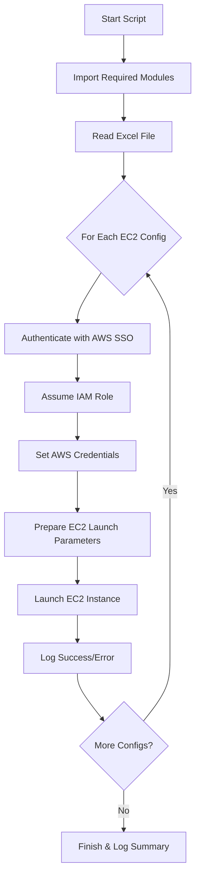

# Launch-EC2FromExcel.ps1 Summary

This PowerShell script automates the process of launching EC2 instances in AWS using configuration data from an Excel file. It is designed to work with multiple AWS SSO profiles and supports advanced EC2 options.

## Key Features
- Reads EC2 instance configuration from an Excel file (worksheet: EC2_Instances)
- Authenticates to AWS using SSO profiles for each account
- Assumes the specified IAM role in each account
- Launches EC2 instances with detailed configuration options (network, storage, tags, etc.)
- Logs all actions and errors to a log file
- Supports advanced EC2 features: block device mapping, metadata options, CPU options, monitoring, tags, and more

## Prerequisites
- AWSPowerShell.NetCore module (located at D:\psmodules)
- ImportExcel PowerShell module
- AWS CLI installed and configured with SSO profiles
- Excel file with EC2 configuration

## Script Workflow

## Main Steps
1. **Import Modules:** Loads AWSPowerShell.NetCore and ImportExcel.
2. **Read Excel File:** Loads EC2 instance configuration from the specified worksheet.
3. **Iterate Configurations:** For each row in the Excel file:
    - Authenticates to AWS using SSO for the target account/profile.
    - Assumes the specified IAM role.
    - Sets AWS credentials for the session.
    - Prepares EC2 launch parameters (network, storage, tags, etc.).
    - Launches the EC2 instance.
    - Logs the result (success or error).
4. **Logging:** All actions and errors are logged to a timestamped log file.

## Advanced Options Supported
- Private/Public IP assignment
- Security groups
- IAM instance profile
- EBS optimization
- Block device mapping
- Monitoring
- Metadata options
- CPU options
- API termination protection
- Shutdown behavior
- SR-IOV/ENA support
- User data
- Tags

## Error Handling
- Errors during authentication, role assumption, or instance launch are logged and do not stop the script from processing other configurations.

---

This script is ideal for bulk launching EC2 instances across multiple AWS accounts using a single Excel configuration file and SSO authentication.
